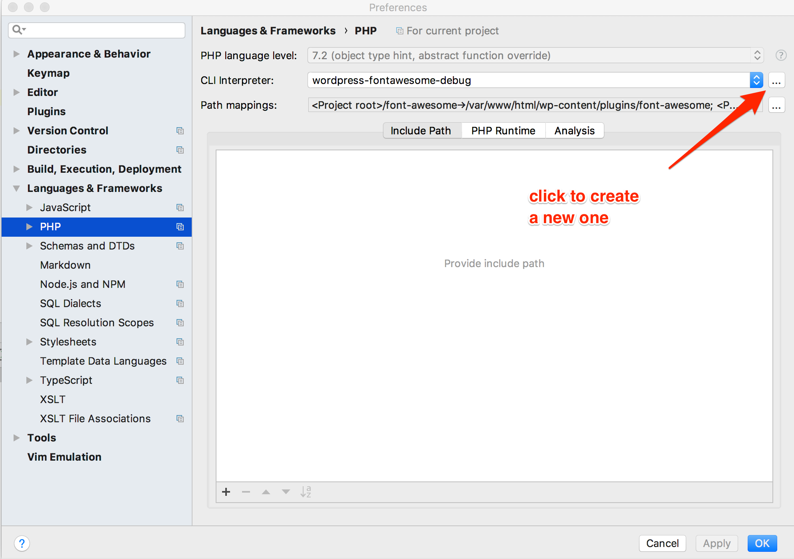

# Development

> Font Awesome 5 Official WordPress Plugin DEVELOPMENT

<!-- toc -->

- [Introduction](#introduction)
- [Development Setup](#development-setup)
- [Run phpunit](#run-phpunit)
  * [Pass arguments to phpunit](#pass-arguments-to-phpunit)
- [Use wp-cli within your Docker environment](#use-wp-cli-within-your-docker-environment)
- [Run anything else within your Docker environment](#run-anything-else-within-your-docker-environment)
  * [Run a shell insider your Docker environment](#run-a-shell-inside-your-docker-environment)
- [Set a boolean config in `wp-config.php`](#set-a-boolean-config-in-wp-configphp)
- [Reset WordPress Docker Environment and Remove Data Volumes](#reset-wordpress-docker-environment-and-remove-data-volumes)
- [Inspecting and Re-setting Plugin States](#inspecting-and-re-setting-plugin-states)
  * [Main Options](#main-options)
  * [Releases Metadata Transient](#releases-metadata-transient)
  * [V3 Deprecation Warning](#v3-deprecation-warning)
- [Cut a Release](#cut-a-release)
- [Run a Local Docs Server](#run-a-local-docs-server)
- [Special Notes on plugin-sigma](#special-notes-on-plugin-sigma)
- [Remote Debugging with VSCode](#remote-debugging-with-vscode)
- [Configure PhpStorm 2018.1.5 for debugging](#configure-phpstorm-201815-for-debugging)

<!-- tocstop -->

# Introduction

This repo provides a multi-dimensional Docker-based development environment to help developers work with the `font-awesome`
plugin under a variety of conditions: WordPress version tags `4.9.8` and `latest`,
crossed with `development` and `integration`.

The `development` option mounts this plugin code as a read-write volume inside a container, and also
sets up the environment for the React admin app to do hot module loading through the webpack dev server.

The `integration` option does _not_ mount this plugin code in the container. Instead, it expects you
to install the plugin. You could do so by uploading a zip file on the Add New Plugin page in
WordPress admin: build a zip using `composer dist` or by downloading one from the [plugin's WordPress
plugin directory entry](https://wordpress.org/plugins/font-awesome/). Or you could install directly
from the WordPress plugin directory by searching for plugins by author "fontawesome".

Both options mount the test integrations found under `integrations/` so those themes or plugins can be
activated to help with testing and exploring interaction with the plugin at run time.

# Development Setup

## 0. Install PHP

Most of our PHP code will run inside a Docker container under the version of PHP installed within that container.
However, some of the tools for building or running composer will run outside of the container, in the host environment,
so you'll need a workable version of PHP installed in your host environment.

If you can run `$ php --version` and it shows a PHP version that's 7.1 or later, that should be good enough.

Otherwise, install php in a way appropriate to your host environment. On macOS, use:

`$ brew install php`

### asdf is a nightmare for PHP

While Font Awesome's development environments normally use asdf to help standardize runtime configurations, getting
the PHP plugin for asdf to work successfully on macOS is probably not worth it at this time. The original plugin
has apparently [been abandoned](https://github.com/odarriba/asdf-php#why-using-this-plug-in), and the maintainer of the
current plugin doesn't use it any longer, and thinks that it's ["near to a nightmare"](https://github.com/odarriba/asdf-php/issues/8#issuecomment-362911209)
on macOS.

## 1. Make sure Docker is installed

## 2. Build any number of docker _images_ for the environments you want

Run `bin/build-docker-images` with one or more version tags corresponding to
Dockerfiles in `docker/`.

For example, to build two images:
```bash
$ bin/build-docker-images 4.9.8 latest
```

Once you build these, you won't need to rebuild them unless something changes in the underlying
image dependencies. For a historic WordPress release like `4.9.8` that may never occur.

For `latest`, this could happen if you see that the [`wordpress:latest` tag on Docker Hub](https://hub.docker.com/_/wordpress)
is updated. When a new version of WordPress is released, it can take a little while before a new Docker image
is available for it. So in this development environment, `latest` refers primarily to the the `wordpress:latest`
image on DockerHub, not always as current as the latest WordPress release.

Each image is a pre-requisite for its corresponding container environment.
So if you want to be able to run `bin/dev latest`, you have to first make sure you've built the underlying
docker image with `bin/build-docker-images latest`. 

_BEWARE_: there's one place where this difference in "latest" might shoot us in the foot:
The `docker/install-wp-tests-docker.sh` script runs during the image build process to
install the core WordPress testing files that are important for our `phpunit` test run to work.
It takes a _WordPress_ version tag as an argument. So when the WordPress "latest" version (say `5.0.1`)
and the DockerHub "latest" version are temporarily out of sync, you could be in a state where
the WordPress `5.0.0` (in our example) is running, but with tests tagged for WordPress `5.0.1` are 
installed. Probably this won't cause a real problem, but beware.

## 3. Run an environment (one at a time)

`latest` is the default, so these two are equivalent:

```bash
$ bin/dev latest
```

```bash
$ bin/dev
```

This table shows the matrix for running each container environment:

| version tag  | development | integration |
| --- | --- | --- |
| 4.9.8 | `$ bin/dev 4.9.8` | `$ bin/integration 4.9.8` |
| latest | `$ bin/dev latest` | `$ bin/integration latest` |

Run one of these from the top-level directory that contains the `docker-compose.yml` config file.

Leave it running in one terminal window and do the rest of the workflow in some other terminal windows.

*Setup Required*

At this point, everything is running, but when it's the first time you've run it (or since you
cleared the docker data volume), WordPress has not yet been setup. There's a script for that below.

*Stopping the Environment*
 
When you're ready to stop this environment, use `CTRL-C` in that terminal window where it's running.

*Restarting*

To bring back up the same environment later, just run the same `bin/dev` or `bin/integration` command.

*Start a Different Environment*

To run a _different_ environment, you'll need to first make sure the containers from one environment
are stopped, before starting a new environment. This because the port numbers used for web and db are
the same regardless of environment, so you can only have one running at a time.

*Stop an Environment's Containers*

You can make sure all containers are stopped like this:

```bash
$ docker-compose down
```

You could also be a little more ninja-ish and use `docker ps` to find the running containers you know
you want to stop, find the container ID for each, and then for each one do `docker container stop <container_id>`.

## 4. create a .env.email file in the root of the repository with an admin email address WordPress can use

```
WP_ADMIN_EMAIL=some_real_address@example.com
```

## 5. install composer (PHP package manager)

On Mac OS X, it can be installed via `brew install composer`

## 6. update composer dependencies

From the top-level directory that contains `composer.json`:

```
composer install
```

## 7. OPTIONAL: start the admin React app's development build (in development)

In one terminal window, `cd admin`, and then:

  (a) `yarn`

  (b) `yarn start` to fire up webpack development server, if you want to run in development mode with
      hot module reloading and such.
      This will start up another web server that serves up the assets for the React app separately from
      the WordPress site, so leave it running while you develop.

## 8. OPTIONAL: Configure a loopback network address so the docker container can talk to your docker host

You'll need this for the `development` environment option.

With our current configuration, the docker container in which the wordpress server runs may need to access
your host OS for a couple of things:

- PHP debugging port
- Webpack dev server port for React hot module reloading

One way to set that up on your host is (on Mac OS):

`sudo ifconfig lo0 alias 169.254.254.254`

### Caveat

The normal paradigm for Docker is not to allow the containers to access the host's network. That's generally
appropriate, given Docker's goals to create a clean, isolated, and secure environment.
However, we kinda know what we're doing here, and it's only for development purposes on our local development
machines, so it's reasonable to set up a loopback address on the host that will allow the containers to
reach the host network for the purposes listed above. (I know, there are less [hacky ways](https://docs.docker.com/docker-for-mac/networking/#use-cases-and-workarounds) to do this,
and we need to clean up this part of the environment setup at some point. But this works on Mac OS where
some of the simpler methods do not. NOTE: on non-Mac host OSes the command line comparable to
the `ifconfig` command above may be different. Read your man pages or something.)

The result will be a line is added to the `/etc/hosts` in the container that assigns the hostname `dockerhost`
to that IP Address, and that's the address used by the Apache config, for example, for proxying some requests
over to the webpack dev server running on `http://dockerhost:3030`.

If you need to change which loopback IP address is used for some reason, it's configured in `docker-compose.yml`.

(TODO: change configuration to use [`host.docker.internal`](https://docs.docker.com/docker-for-mac/networking/#use-cases-and-workarounds) for Mac OS and the equivalent for other host OSes)

## 9. run `bin/setup`

This does the initial WordPress admin setup that happens first on any freshly installed WordPress
site. We're just doing it from the command line with the script to be quick and convenient.

It also adds some configs to `wp-config.php` for debugging: `WP_DEBUG`, `WP_DEBUG_LOG`, `WP_DEBUG_DISPLAY`.

By default, it will use the container named `com.fontawesome.wordpress-latest-dev`, which will be the container made from the `latest` image.

You can use a `-c <container_id>` argument to connect to run the command against a different container. This pattern is consistent across most of the scripts under `bin/`, such as `bin/wp` and `bin/php`.

After setup completes, WordPress is ready and initialized in the docker container and reachable at [http://localhost:8080](http://localhost:8080).

You can login to the admin dashboard at [http://localhost:8080/wp-admin](http://localhost:8080/wp-admin) with admin username and password as found in `.env`.

## 10. Install and/or Activate the Font Awesome plugin

If you're running the `bin/dev` environment, you'll find in the admin dashboard that the
Font Awesome is already installed, because the source code in this repo is mounted as a volume
inside the container. You can activate or deactivate the plugin, but you'll find that if you try
to uninstall it, it seems to wipe out the plugin's code from the working directory of this repo.
So, probably don't do that.

If you're running the `bin/integration` environment, install via zip archive upload or directly
from the WordPress plugins directory. [See above](#development) for more details. 

After activating the plugin you can access the Font Awesome admin page here:
`http://localhost:8080/wp-admin/options-general.php?page=font-awesome`

Or you'll find it linked on the left sidebar under Settings.

# Run phpunit

```bash
$ bin/phpunit
```

This runs `phpunit` in the default docker container. It's just a docker wrapper around the normal `phpunit` command,
so you can pass any normal `phpunit` command line arguments you might like.

To run the loader tests, use this alternate test config:

```bash
$ bin/phpunit -c phpunit-loader.xml.dist
```

# Use WP-CLI within your Docker environment

For example,

```bash
$ bin/wp plugin list
```

This will run `wp` inside the default container and list plugins.

To run this under a different container, provide the container's name or id with `-c`:

```bash
$ bin/wp -c 193d46dcb77b plugin list 
```

Everything about the command line is the same as you'd normally use for `wp`, except the first
option must be `-c <container_id_name>`

# Run anything else within your Docker environment

```bash
$ bin/env <command_line>
```

This is a wrapper that just executes `<command_line>` inside the specified running container.

Again, use `-c <container_id_name>` to specify a non-default docker container.

## Run a shell inside your Docker environment

```bash
$ bin/env bash
```
# Set a boolean config in wp-config.php

```bash
bin/set-wp-config WP_DEBUG true
```

(Though this particular config is already set automatically in `bin/setup`.)

# Reset WordPress Docker Environment and Remove Data Volumes

```bash
$ bin/clean
```

This will kill and remove docker containers and delete their data volumes.

It will also try to clean up helper containers created by PhpStorm, if you're using that IDE. 

If you do something accidentally to modify the wordpress container and put it into a weird state
somehow, or even if you just want to re-initialize the whole WordPress environment (i.e. the app and the mysql db),
this is how you can do it.
 
This doesn't remove the docker _images_, just the containers and their data volumes.
So you won't have to rebuild images after a `clean`. But also, if what you're trying to do is
remove those images, you'll need to use `docker image rm <image_id>`.
 
After a `bin/clean`, you'll need to run a new environment again, such as `bin/dev` and also
re-run setup, like `bin/setup`.

# Inspecting and Re-setting Plugin States

This plugin's behavior depends upon a few different states that are stored in the WordPress database.

## Main Options

The main state is stored under an options key: `font-awesome`.

Inspect it:

```bash
$ bin/wp option get font-awesome
```

Remove it:

```bash
$ bin/wp option delete font-awesome
```

## Releases Metadata Transient

When the plugin retrieves releases metadata from `https://fontawesome.com/api/releases` it caches the results
as a long-lived WordPress transient: `font-awesome-releases`. 

Inspect it:

```bash
$ bin/wp transient get font-awesome-releases
```

Remove it:

```bash
$ bin/wp transient delete font-awesome-releases
```

## V3 Deprecation Warning

Temporarily, this plugin supports Font Awesome version 3 icon names, but also warns that their use is
deprecated. Finally, it allows the site owner to "snooze" the deprecation warning. The state of that
detection or snoozing is stored in an expiring transient: `font-awesome-v3-deprecation-data`.
  
Inspect it:

```bash
$ bin/wp transient get font-awesome-v3-deprecation-data
```

Remove it:

```bash
$ bin/wp transient delete font-awesome-v3-deprecation-data
```

# Cut a Release

1. Update the Changelog at the end of readme.txt

2. Update the plugin version in the header comments of `font-awesome.php`

3. Update the plugin version const in `includes/class-fontawesome.php`

4. Update the version in `admin/package.json`

5. Wait on changing the "Stable Tag" in `readme.txt` until after we've made the changes in the `svn` repo below.

6. Build the API docs

- make sure you have `graphviz` installed (on mac OS, you can do this with `brew install graphviz`)
- run `composer cleandocs` if you want to make sure that you're building from scratch
- run `composer install --dev` to install the dev-only phpDocumentor package 
- run `composer docs` to build the docs into the `docs/` directory

  This command will incrementally rebuild docs with any updates you make to the phpDoc
  in the source code files.
 
  See also: [Run a Local Docs Server](#run-a-local-docs-server)

- `git add docs` to stage them for commit (and eventually commit them) 

7. Build production admin app and WordPress distribution layout into `wp-dist` 

```bash
$ composer dist
```

This will delete the `vendor` directory, and previous build assets, and will re-install
the composer bundle in production mode (`--no-dev --prefer-dist`) and produce the following:

`wp-dist/`: the contents of this directory should be moved into the svn repo for the WordPress plugin
that will be published through the WordPress plugins directory.

`font-awesome.zip`: a zip file of the contents of `wp-dist` with path names fixed up.
This zip file can be distributed as a download for the WordPress plugin and used for installing
the plugin by "upload" in the WordPress admin dashboard.

`admin/build`: production build of the admin UI React app. This need to be committed so that it
can be included in the composer package (which is really just a pull of this repo)  

8. Run through some manual acceptance testing

Load up the `integration` WordPress environment in this repo (see above for how to do that).

Install the Font Awesome plugin from the admin dashboard by uploading the `font-awesome.zip` file
that was created in the previous step.

- activate and deactivate the plugin: expect no errors
- enable "remove unregistered clients" and reload the plugin's admin page. Expect it to show up!
- activate `theme-alpha`, `plugin-beta`, `plugin-delta`, `plugin-eta`, `plugin-gamma`, and `plugin-zeta`
- expect to see all of their client requirements listed on the options page under Client Requirements
  - Especially, look for `plugin-gamma` and `plugin-delta` outputs in all three contexts: front end, admin, login
- expect to see `plugin-gamma` and `plugin-delta` listed in the unregistered clients section
- expect to see the over all stat of the plugin to be good/success (such as showing a green thumb icon)
- change settings on the plugin options page to enable Pro and remove unregistered clients
- view the site: expect to see all of those integration plugins doing their thing with no missing icons
- deactivate all of those integration testing plugins and activate `plugin-epsilon`: expect a fatal error admin notice in the admin UI, but it should not crash WordPress or throw an exception with stack trace in the browser.  
- ( If you know how to properly test with `plugin-sigma`--it's more complicated--go for it. )

9. Check out and update the plugin svn repo into `wp-svn` (the scripts expect to find a subdirectory with exactly that name in that location)

To check it out initially:

```bash
svn co https://plugins.svn.wordpress.org/font-awesome wp-svn
```

If you've already checked it out, make sure it's up to date:

```bash
$ cd wp-svn
$ svn up
$ cd ..
``` 

10. Copy plugin directory assets and wp-dist layout into `wp-svn/trunk`

```bash
$ composer dist2trunk
```

This script will just `rm *` anything under `wp-svn/trunk/*` and `wp-svn/assets/*` to make sure that if the new dist
layout changes the file list from the previous release, or if there are changes to the list of files in `wp-svn/assets`,
they will show up as file changes when you do `svn stat`.

11. Make sure the svn trunk makes sense with respect to added or removed files

```bash
$ cd wp-svn
$ svn stat
```

If there are files with `!` status, that indicates they no longer exist and you should do `svn delete` on each of them.

You can do `svn delete` on lots of files with that status at once like this:

```bash
$ svn stat | grep '^\!' | sed 's/^\![\ ]*trunk/trunk/' | xargs svn delete
``` 

If there are files with `?` status, that indicates they are being added and you should do `svn add` on each of them.

You can do `svn add` on lots of files with that status at once like this:

```bash
svn stat | grep '^\?' | sed 's/^\?[\ ]*trunk/trunk/' | xargs svn add
```

Pay attention to files under either `wp-svn/assets` or `wp-svn/trunk`.

For example, every time the admin client is rebuilt and the bundle content changes, the hashes on the bundle file names
change. So you'll end up removing the old ones and adding the new ones.

If there's an editor dotfile or other directory that should be ignored by `svn`, you can do something like this:

```bash
$ svn propset svn:ignore .idea .
``` 

12. Check in the new trunk

Make sure that the `Stable Tag` in `wp-svn/trunk/readme.txt` still reflects the _previous_ release at this point.
It should point to the previous release that has a subdirectory under `tags/`.

(Suppose `42.1.2` is the new version we're releasing. Change it in the examples to use real release version numbers.)

`svn ci` is what publishes the plugin code to the WordPress plugins directory, making it public.

```bash
$ svn ci -m 'Update trunk for release 42.1.2' 
```

If you're not already authenticated to `svn`, add the `--username` option to `svn ci` and it will prompt you for your
password. After the first `svn ci` caches the credentials, you probably won't need to include `--username`.

[See also tips on using SVN with WordPress Plugins](https://developer.wordpress.org/plugins/wordpress-org/how-to-use-subversion/#editing-existing-files).

13. Create the new svn release tag

First, make sure `svn stat` is clean. We want to make sure that the trunk is all committed and clean before we take a 
snapshot of it for the release tag.

This will snapshot `trunk` as a new release tag. Replace the example tag name with the real release tag name.

```bash
$ svn cp trunk tags/42.1.2 
```

14. Update `Stable tag` and `Tested up to` tags in `readme.txt`

We've now got three copies of `readme.txt` that should all be updated with new tag values:

- `wp-svn/trunk/readme.txt`
- `wp-svn/tags/<new_tag_name>/readme.txt`
- `readme.txt` (in the git repo)

15. Check in the latest changes to svn.

(Again, use the real version number)

From the `wp-svn` dir:

```bash
$ svn ci -m 'Release 42.1.2'
```

16. `git add` and `git commit` all that would have been changed so far:

- `docs/`
- `admin/build`
- `font-awesome.php`
- `includes/font-awesome.php`
- `admin/package.json`
- `readme.txt`

17. `git push` to GitHub remote

Single release commits can be pushed directly to `master`. If there are several commits, push to a topic branch and squash/merge
them into `master` as a single commit.

18. Create a GitHub release that tags that new release commit

# Run a Local Docs Server

If you want to preview the built docs with a web server, you can run `composer docsrv` and then
point a web browser at `http://localhost:3000`. Composer has a default `process-timeout` of 300
seconds, so if you leave `docsrv` running for a while, composer will kill it and orphan
the node process. On macOS, you can find that process id with the shell command:
 ```
 lsof -t -i :3000
 ```
You'll probably just need to `kill` that `pid` and re-launch it.
Or to avoid the timeout hassle, just do:
```bash
cd docsrv
yarn
node index.js
```

# Special Notes on plugin-sigma

`plugin-sigma` demonstrates how a third-party plugin developer could include this Font Awesome plugin as a composer
dependency. In this scenario, the WordPress site admin does not need to separately install the Font Awesome plugin.

In order to activate it you must first run `composer install --prefer-dist` from the 
`integrations/plugins/plugin-sigma` directory.

# Remote Debugging with VSCode

1. Install the PHP Debug (Felix Becker) extension in VSCode
1. Restart VSCode
1. Click the debug tab (looks like a crossed-out bug icon)
1. Add configuration...
1. Select PHP
1. It will show you a default `launch.json` file that includes a "Listen for XDebug. Our container is configured to run XDebug on port 9000, so double-check that this is the port set up there. It should be the default.
1. Add to that "Listen for XDebug" section, the following:
    ```json
    "pathMappings": {
      "/var/www/html/wp-content/plugins/font-awesome": "${workspaceRoot}"
    }
    ```

# Configure PhpStorm 2018.1.5 for debugging

(This seems to be a black art and doesn't always work for reasons unknown.
Your mileage may vary. And if you find a better way, please update this!)

This is pretty advanced, and also not necessary for development—it's just a nice toolset to have available.
So beware: your mileage may vary.

1. Add a CLI interpreter

Preferences -> Languages & Frameworks -> PHP



Add a new CLI interpreter with Docker Compose. We'll call it `wordpress-fontawesome-debug`.


* Enter `./docker-compose.yml` for the configuration file.
* Service: `wordpress`
* PHP Executable: php
* Debugger extension: xdebug.so
* Configuration options:
  * xdebug.remote_enable=1
  * xdebug.remote_host=docker.for.mac.localhost
  * xdebug.remote_port=9000
  * xdebug.remote_mode=jit

2. Configure Debugging

The defaults may be fine, but the key is to uncheck the option circled in the screenshot.

[See also](https://intellij-support.jetbrains.com/hc/en-us/community/posts/360000229624-Setting-up-xDebug-with-PHPUnit-using-Docker-for-Mac-and-PHPStorm)


3. Configure Test Framework

Our test framework is PHPUnit, and it will run "remotely", because it's in a Docker container.


* CLI Interpreter: select the one we created previously.
* Path mappings: these should be auto-populated, based on the `docker-compose.yml` being used by our CLI interpreter. If not, then look at the `docker-compose.yml`
  to guide you in setting up path mappings. For example, your host directory `/Users/you/repos/wordpress-fontawesome/font-awesome` should map to container
  directory `/var/www/html/wp-content/plugins/font-awesome`.
* Path to phpunit.phar: this should be the full path _inside_ the container.
* Default configuration file and Default bootstrap file: these are also full paths _inside_ the container.


4. Create Run and Test Configurations

(Menu) Run -> Edit Configurations...

For running and debugging tests:


This is where you can configure which tests run when you invoke this test runner. You could create more than one test configuration
for conveniently running different test groups. In this pictured configuration, we're just using the test configuration file that
  we previously configured for use by the Test Framework.

To run that run configuration, you can select it here (red arrow) and then either run it normally or run it under debugging (green arrows):


## Gotcha: `wordpress-fontawesome_phpstorm_helpers_1` container fails to start

It may throw an error like "network \<some_big_hex_value\> not found".

This happens, apparently, when _after_ you initially set up this configuration, you change the network id for the Docker Compose compose container.
And this could happen if you ran `docker-compose down` or ran the local `bin/clean`. These tear down the network as well as the container.
But PhpStorm creates a `php_helper` container and associates it wih this network. So if you remove the network, it will fail miserably.

A solution is just to remove that container and then try again in PhpStorm. It will just recreate that helper container and  associate it with the
new `docker-compose` network.

There's more than one way to delete that container, but one way is to find the container's name and run:
* `docker container stop wordpress-fontawesome_phpstorm_helpers_1`
* `docker container rm wordpress-fontawesome_phpstorm_helpers_1`

